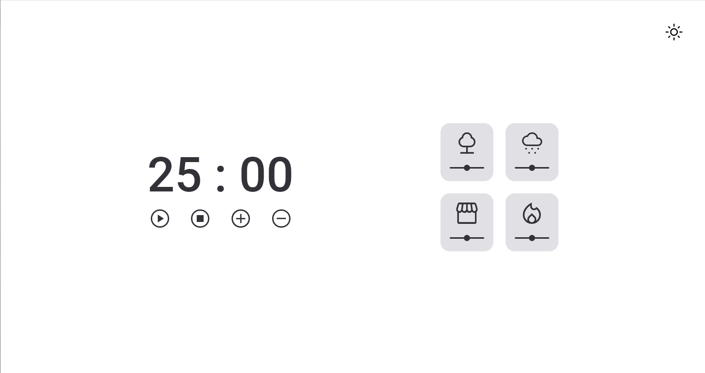

# Focus Timer

> Trilha Explorer

## 💻 Projeto

Projeto de um temporizado pomodoro onde além de ter todas a funcinalidades de um pomodoro, tem ajustes de tempo, tem sons ambiente para concetração e ajuste de controle de volume, além de ter o maravilhoso Dark Mode!

## 🧑‍💻Tecnologias 

- HTML
- CSS
- JavaScript
- Git
- Github

## Screenshots

## Site do Projeto

[Link do Projeto](https://tthiagoelifas.github.io/FocusTimer/)
